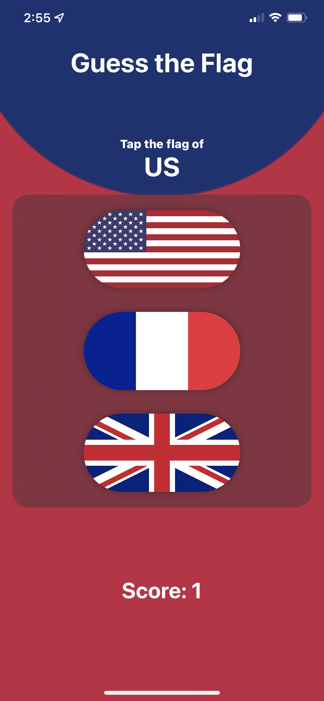

# GuessTheFlag
Project number 2 of 100 days of SwiftUI course. Days 20, 21, 22

This is a simple single page game for learning flags, aimed at learning some basic swift and animation effects. 

The code includes solutions to the challenges and updated bits from further on in the course. Feel free to use anything that you find here, but remember the point is to learn!
